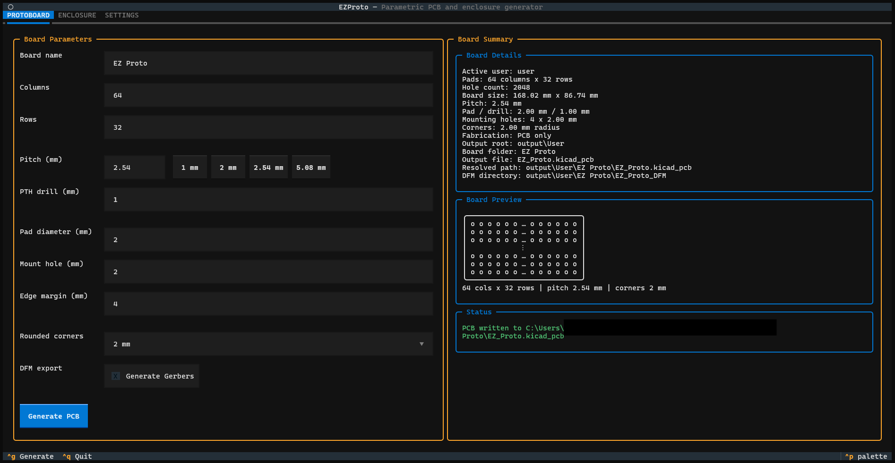
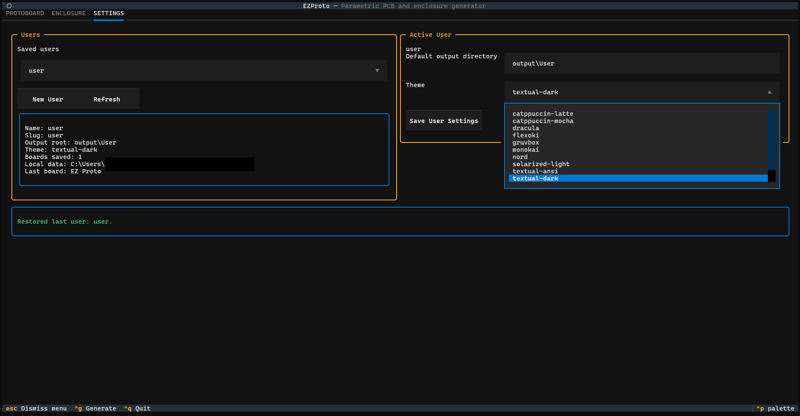
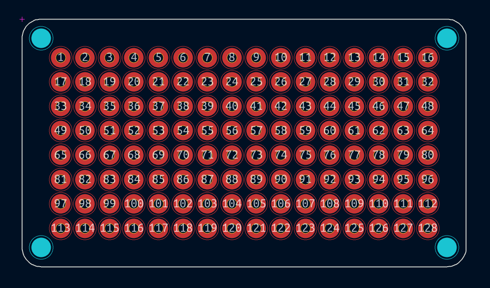
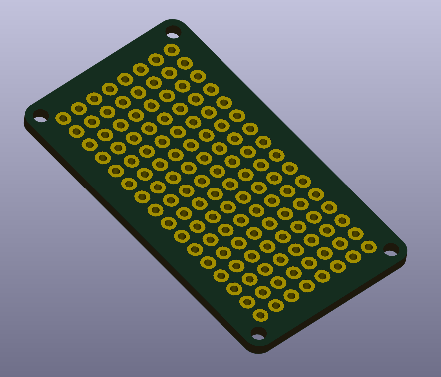

# EZProto

EZProto is a Textual-based desktop terminal app for generating simple parametric protoboards directly in KiCad's native `.kicad_pcb` format.



Right now the app is focused on the `PROTOBOARD` workflow:

- Generate plated through-hole pad grids
- Add optional corner mounting holes
- Create square or rounded board outlines
- Optionally export a simple Gerber + drill fabrication package
- Save per-user defaults, theme choice, and generated-board history

The `ENCLOSURE` tab is present in the UI but intentionally empty for now.



## Features

- Native KiCad PCB output in text-based `.kicad_pcb` format
- Parametric board sizing from rows, columns, pitch, and margins
- PTH drill and pad diameter control
- Optional corner mounting holes
- Optional rounded corners with geometry validation
- Terminal-friendly board preview inside the app
- User profiles and app state stored in a per-user EZProto data directory
- Optional DFM export with Gerber, drill, and ZIP packaging options





## Requirements

- Python `3.12` or newer
- `pip`
- A terminal that can run Textual apps
- KiCad is not required to generate files, but you will want KiCad installed to open and inspect the generated `.kicad_pcb` files

## Installation

### 1. Clone the repository

```powershell
git clone https://github.com/diedasman/EZProto.git
```
```powershell
cd EZProto
```

Important: every install command below assumes your terminal is inside the project root, the folder that contains `pyproject.toml`.

### 2. Create a virtual environment

Windows PowerShell:

```powershell
python -m venv .venv
```
```powershell
.venv\Scripts\Activate.ps1
```

Windows Command Prompt:

```bat
python -m venv .venv
```
```bat
.venv\Scripts\activate.bat
```

Linux / macOS:

```bash
python3 -m venv .venv
```
```bash
source .venv/bin/activate
```

### 3. Install the project

```powershell
python -m pip install --upgrade pip
```
```powershell
python -m pip install -e .
```

This installs the `ezproto` command from the local source tree in editable mode.

#### 4. Summary

```bash
git clone https://github.com/diedasman/EZProto.git
cd EZProto
python -m venv .venv
.venv\Scripts\Activate.ps1
python -m pip install -e .
ezproto
```


## VS Code Setup

If you are opening the project in VS Code, select the virtual environment interpreter after installation:

1. Open the command palette.
2. Run `Python: Select Interpreter`.
3. Choose `.venv\Scripts\python.exe` on Windows or `.venv/bin/python` on macOS/Linux.

This helps VS Code resolve the `textual` imports and the local `src` package correctly.

## How To Run

From anywhere after installation:

```powershell
ezproto
```

Alternative:

```powershell
python -m ezproto
```

You do not need to run EZProto from the project root anymore. By default it stores local data in a per-user application data folder:

- Windows: `%APPDATA%\EZProto`
- macOS: `~/Library/Application Support/EZProto`
- Linux: `$XDG_DATA_HOME/EZProto` or `~/.local/share/EZProto`

If you already used an older repo-root layout, EZProto will migrate that data to the new location the first time it starts.

## Updating EZProto

If you installed EZProto from the repository as documented above, you can update it with:

```powershell
ezproto update
```

The update command:

- verifies that EZProto is backed by a git checkout
- stops if that checkout has local uncommitted changes
- runs `git pull --ff-only`
- refreshes the editable install with your current Python environment

If EZProto was not installed from a git checkout, re-clone the repository and reinstall with:

```powershell
python -m pip install -e .
```

## First-Time Setup In The App

**When the app opens:**

1. Go to the `SETTINGS` tab.
2. Create a user.
3. Set the user's default output directory.
4. Pick a Textual theme if you want.
5. Save the user settings.
6. Return to `PROTOBOARD`.

EZProto restores the last selected user on the next launch.

## Using The PROTOBOARD Tab

Fill in the board parameters:

- `Board name`
- `Columns`
- `Rows`
- `Pitch (mm)`
- `PTH drill (mm)`
- `Pad diameter (mm)`
- `Mount hole (mm)`
- `Edge margin (mm)`
- `Rounded corners`

You can also use the pitch preset buttons:

- `1 mm`
- `2 mm`
- `2.54 mm`
- `5.08 mm`

If `Mount hole` is set to `0`, corner mounting holes are disabled.

If `Generate Gerbers` is enabled before pressing `Generate PCB`, EZProto will create Gerber outputs in addition to the KiCad board file.

Optional DFM export controls:

- `Include drill file` adds the plated drill file to the DFM package.
- `.ZIP archive` creates a `*_DFM.zip` archive next to the DFM folder.

The right side of the `PROTOBOARD` tab shows:

- A summary of the current board parameters
- The resolved output paths
- A terminal-friendly board preview
- Status messages after generation

## Generated Output Structure

For a board named `My Proto Board`, EZProto writes:

```text
<user output directory>/
  My Proto Board/
    My_Proto_Board.kicad_pcb
    My_Proto_Board_DFM/
      My_Proto_Board_F_Cu.gbr
      My_Proto_Board_B_Cu.gbr
      My_Proto_Board_F_Mask.gbr
      My_Proto_Board_B_Mask.gbr
      My_Proto_Board_Edge_Cuts.gbr
      My_Proto_Board.drl
    My_Proto_Board_DFM.zip
```

Notes:

- The folder name matches `Board name` exactly.
- The file stem replaces spaces with underscores.
- Gerber files are only created when `Generate Gerbers` is checked.
- The drill file is only created when `Include drill file` is checked.
- The ZIP archive is only created when `.ZIP archive` is checked.

## User Data And Logging

EZProto stores user and app metadata locally inside its per-user data directory:

- `users/<user_slug>.json`
  - user name
  - default output directory
  - theme
  - last generated board
  - saved board history
- `app_state.json`
  - last active user
  - last generated board
  - event log

You can override the storage location for development or portable installs by setting `EZPROTO_DATA_DIR` before launching EZProto.

Example:

```powershell
$env:EZPROTO_DATA_DIR = "D:\EZProtoData"
ezproto
```

Board history is only updated after a successful KiCad PCB write.

If the same board name is generated again for the same user, its saved metadata entry is overwritten with the latest details.

## Development Commands

Run the test suite:

```powershell
python -m unittest discover -s tests -v
```

Quick syntax/compile check:

```powershell
python -m compileall src tests
```

## Current Scope

- Protoboard PCB generation
- Simple Gerber, drill, and ZIP export
- User profiles and app state persistence
- Theme selection
- Board preview (ASCII)

Planned / in progress:

- Enclosure generation
- 3D export workflow
- More advanced fabrication output and board features
